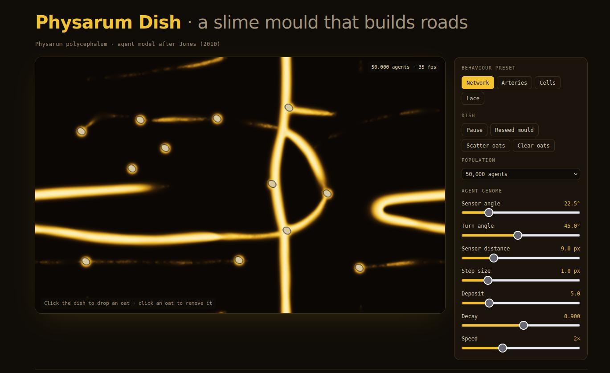

<p align="center">
  
</p>

<h1 align="center">Physarum Dish</h1>

<p align="center">
  A slime mould that builds roads, simulated in a single HTML file.<br>
  Tens of thousands of simple agents grow transport networks between oat flakes you place.
</p>

<p align="center">
  <a href="LICENSE"></a>
  
  
</p>

---

## What is this?

*Physarum polycephalum* is a yellow slime mould with no brain and no central plan, yet it finds efficient routes between food sources. This project reproduces that behaviour using the agent model described by Jeff Jones (2010).

Each agent knows almost nothing: a position, a heading, and three sensors pointing ahead, ahead-left and ahead-right. On every tick, each agent:

1. Smells the chemical trail at its three sensors.
2. Turns toward the strongest smell.
3. Steps forward.
4. Drops a little trail where it lands.

The dish then blurs the trail slightly and lets it evaporate. Branching veins, loops and pruned dead ends all emerge from those rules alone.

## Quick start

No build step, no install.

```bash
git clone https://github.com/Webslug/physarum.git
cd physarum
```

Then open `physarum.html` in any modern browser.

The only external request is Google Fonts. If you are offline, the page falls back to system fonts and the simulation runs the same.

## Using the dish

| Action | What it does |
| --- | --- |
| Click the dish | Drops an oat flake |
| Click an oat | Removes it |
| **Scatter oats** | Places a new random set of oats |
| **Clear oats** | Removes all oats |
| **Reseed mould** | Wipes the trail and restarts from the centre |
| **Pause / Resume** | Freezes the simulation |
| **Population** | 20,000 to 200,000 agents |

### Presets

| Preset | Behaviour |
| --- | --- |
| **Network** | Branching, road-like networks. The classic look. |
| **Arteries** | Long sensor reach and slow decay give fat, looping trunks. |
| **Cells** | Wide sensors and small turns break the mould into drifting blobs. |
| **Lace** | Short sensors and sharp turns give fine, filigree mesh. |

### The agent genome

Every slider maps to one named parameter:

| Parameter | Meaning |
| --- | --- |
| Sensor angle | How far left and right the side sensors point |
| Turn angle | How sharply an agent turns toward a stronger trail |
| Sensor distance | How far ahead each sensor smells |
| Step size | Distance moved per tick |
| Deposit | Trail dropped per step |
| Decay | Fraction of trail that survives each tick |
| Speed | Simulation ticks per rendered frame |

The ratio of sensor angle to turn angle has the biggest effect. Around 1:2 gives branching networks. Wide sensors with narrow turning collapse the mould into cells.

## Code layout

The script is split into modules that each do one job, in a single file:

| Module | Responsibility |
| --- | --- |
| `SIM_CONFIG` / `PARAM_SCHEMA` / `PARAM_PRESETS` | Constants, slider definitions, presets |
| `SIM_STATE` | Current parameters and run state |
| `TRAIL_FIELD` | The chemical grid: sample, deposit, blur and decay |
| `AGENT_SWARM` | Agent arrays, seeding and the sense-turn-move step |
| `OAT_NODES` | Food sources that emit constant trail |
| `RENDERER` | Colour ramp, canvas drawing, pointer mapping |
| `CONTROL_PANEL` | Presets, sliders and buttons |
| `MAIN_LOOP` | Tick order, frame loop and startup |

## Background

In 2010, Tero and colleagues placed oat flakes at the positions of the cities around Tokyo and let real *Physarum* grow between them. The tubes it built closely matched the efficiency and fault tolerance of the actual rail network. Try **Scatter oats** and watch the same kind of trade-off form.

## References

- Jones, J. (2010). *Characteristics of pattern formation and evolution in approximations of Physarum transport networks.* Artificial Life, 16(2), 127-153.
- Tero, A. et al. (2010). *Rules for biologically inspired adaptive network design.* Science, 327(5964), 439-442.

## License

Licensed under the [Apache License, Version 2.0](LICENSE).

```
Copyright 2026 Webslug

Licensed under the Apache License, Version 2.0 (the "License");
you may not use this file except in compliance with the License.
You may obtain a copy of the License at

    http://www.apache.org/licenses/LICENSE-2.0

Unless required by applicable law or agreed to in writing, software
distributed under the License is distributed on an "AS IS" BASIS,
WITHOUT WARRANTIES OR CONDITIONS OF ANY KIND, either express or implied.
See the License for the specific language governing permissions and
limitations under the License.
```
